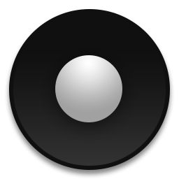
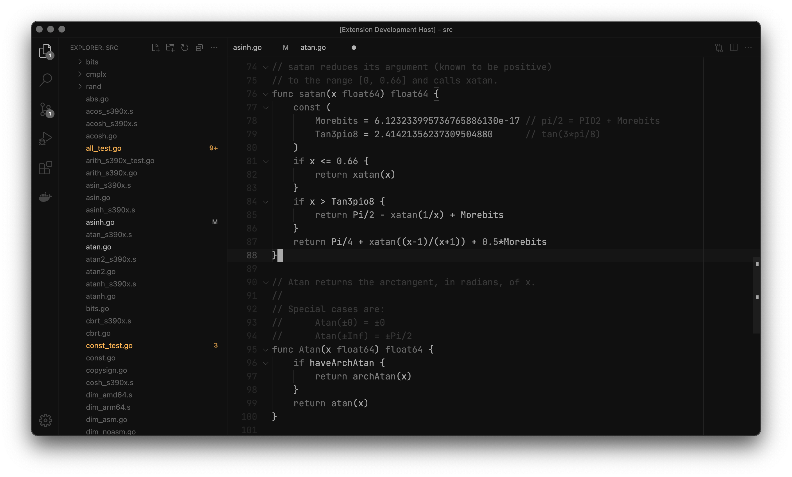
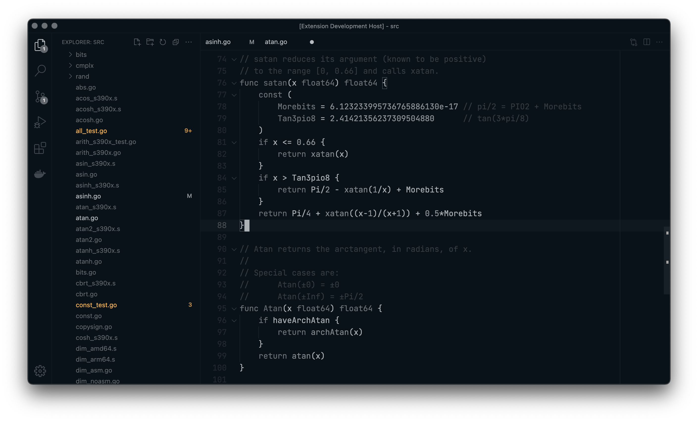
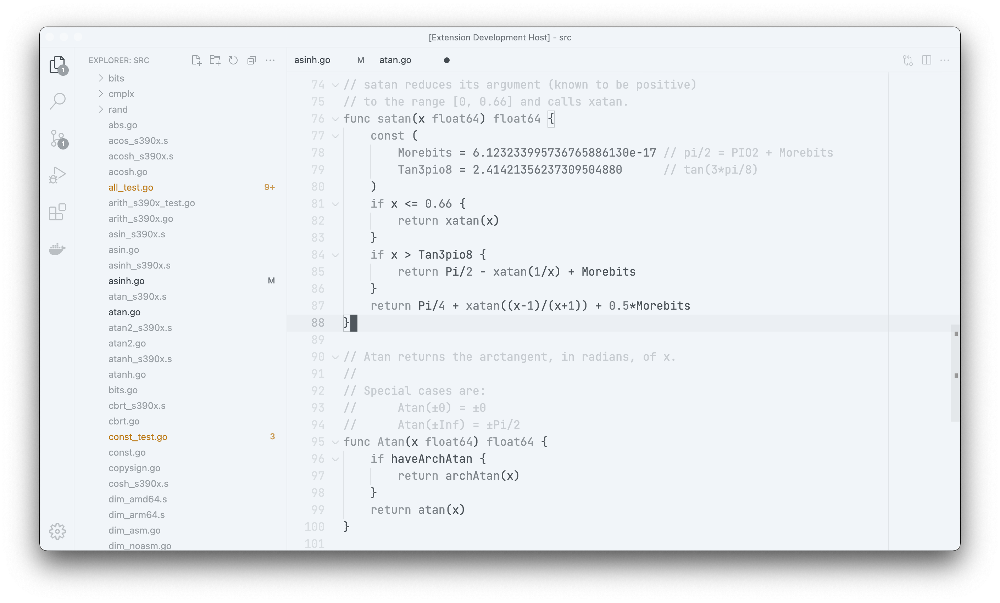
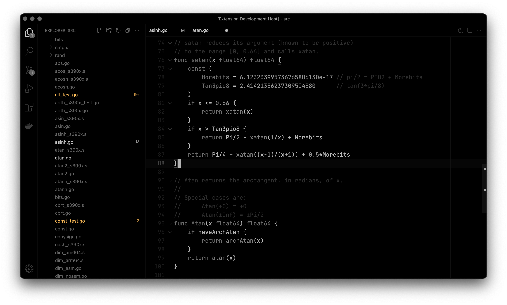
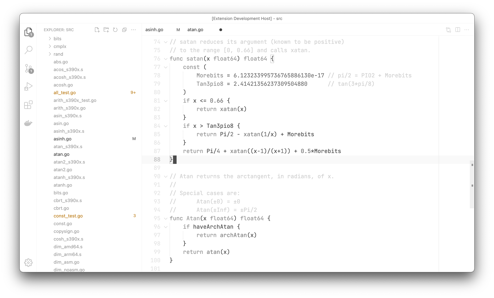
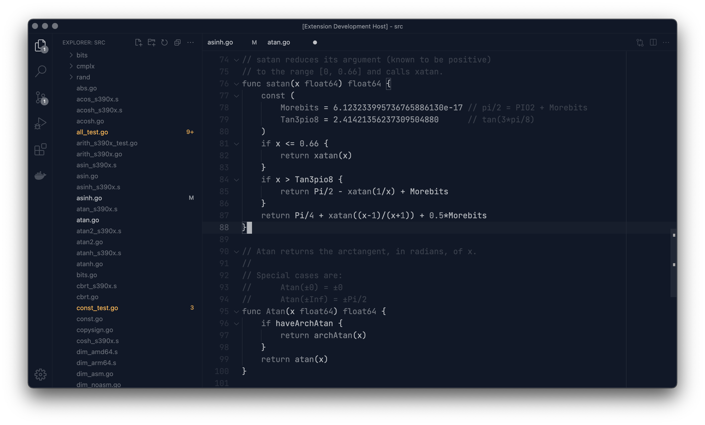
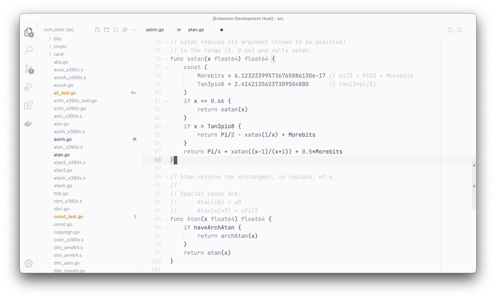

<p align="center">
  
</p>

# Monochrome

Monochrome is a monochromatic<sup>[1]</sup> theme collection for **Visual Studio Code**.

1. Except for warning and error colors in the explorer panel, since it would be hard to tell the difference between them. They also helps to improve the productivity by annoying you when the colors disturbs the visual integrity of the monochromatic screen, so you can feel accomplishment and relief when you get rid of the problems.

### Table of Content

1. [Previews](#previews)
2. [Base Colors](#base-colors)
3. [Fine Tunings](#fine-tunings)
4. [Suggested Settings](#suggested-settings)

## Previews

Click to enlarge the previews.

|                       Name | Preview                                                                                                      |
| -------------------------: | ------------------------------------------------------------------------------------------------------------ |
|            Monochrome Dark | [](./preview/monochrome-dark.png)                       |
|           Monochrome Light | [](./preview/monochrome-light.png)                     |
|     Monochrome Dark Subtle | [](./preview/monochrome-dark-subtle.png)         |
|    Monochrome Light Subtle | [](./preview/monochrome-light-subtle.png)       |
|  Monochrome Dark Amplified | [](./preview/monochrome-dark-amplified.png)   |
| Monochrome Light Amplified | [](./preview/monochrome-light-amplified.png) |
|  Monochrome Dark Cool Gray | [](./preview/monochrome-dark-cool-gray.png)   |
| Monochrome Light Cool Gray | [](./preview/monochrome-light-cool-gray.png) |

## Base Colors

As one should be expecting from a _monochromatic_ color scheme, there isn't much of them. There is just **Background** and **Foreground**, rest of the color scheme generated by tweaking the alpha channel of the **Foreground**.

|            Name | Foreground | Background |
| --------------: | :--------: | :--------: |
|            Dark |  #EBEBEB   |  #101010   |
|           Light |  #101010   |  #EBEBEB   |
|     Dark Subtle |  #F1F5F9   |  #0A1219   |
|    Light Subtle |  #0A1219   |  #F1F5F9   |
|  Dark Amplified |  #FFFFFF   |  #000000   |
| Light Amplified |  #000000   |  #FFFFFF   |
|  Dark Cool Gray |  #111827   |  #F9FAFB   |
| Light Cool Gray |  #F9FAFB   |  #111827   |

## Fine Tunings

With the help of the new generator script, you can easily modify an existing color scheme or create a new one.

As an example, let's say you want to increase the overall readability of the `monochrome-dark`, in order to do that, head over the `src/themes.js` file and find the theme definition of the scheme that you want to modify, then append the `amplifier: factor` line to the theme definition like in the example below, this will modify the **foreground multipliers** by the given amount.

```javascript
  theme({
    name: "monochrome-dark",
    background: "#101010",
    foreground: "#EBEBEB",
    amplifier: 1.5,
  }),
```

You can also override theme definitions either with a **foreground multiplier** or a color like in the example below.

```javascript
  theme({
    name: "monochrome-dark",
    background: "#101010",
    foreground: "#EBEBEB",
    override: {
      color: {
        "badge.background": 1,
        "badge.foreground": 0,
        "editorLineNumber.foreground": 0.10196078431372549,
        "button.background": "#FF0000",
      }
    }
  }),
```

Run the script below to automatically generate the themes on file modifications.

```shell
$ pnpm run start
```

Run the script below to build themes.

```shell
$ pnpm run build
```

## Suggested Settings

You can apply the settings below for a minimalist layout that fits well into the monochromatic screen.

```json
{
  "breadcrumbs.enabled": false,
  "breadcrumbs.icons": false,
  "editor.colorDecorators": false,
  "editor.cursorBlinking": "solid",
  "editor.cursorStyle": "block",
  "editor.find.addExtraSpaceOnTop": false,
  "editor.fontFamily": "'IBM Plex Mono', monospace",
  "editor.fontSize": 16,
  "editor.links": false,
  "editor.minimap.enabled": false,
  "editor.occurrencesHighlight": false,
  "editor.renderLineHighlight": "all",
  "editor.renderWhitespace": "none",
  "editor.roundedSelection": false,
  "editor.scrollbar.horizontal": "visible",
  "editor.scrollbar.vertical": "visible",
  "editor.selectionHighlight": false,
  "editor.showFoldingControls": "always",
  "terminal.integrated.fontFamily": "'IBM Plex Mono', monospace",
  "terminal.integrated.fontWeight": "300",
  "workbench.editor.showIcons": false,
  "workbench.editor.tabCloseButton": "off",
  "workbench.iconTheme": null,
  "workbench.tree.indent": 14,
  "workbench.tree.renderIndentGuides": "none"
}
```
